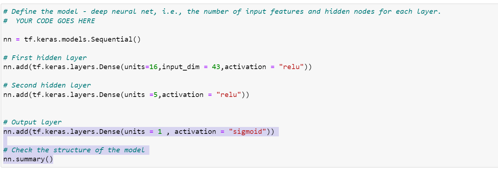
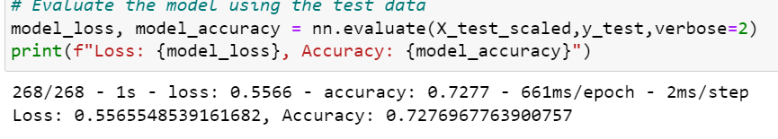
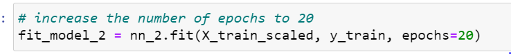
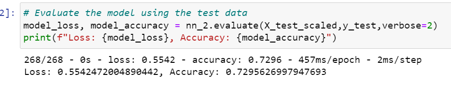
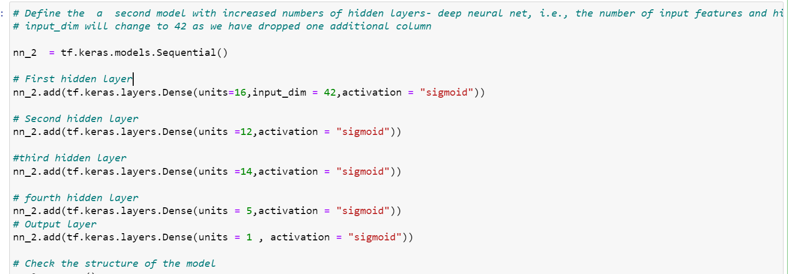
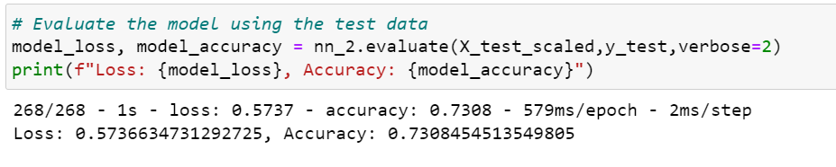
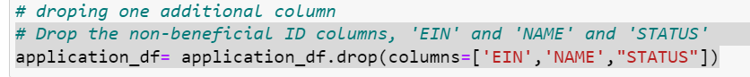
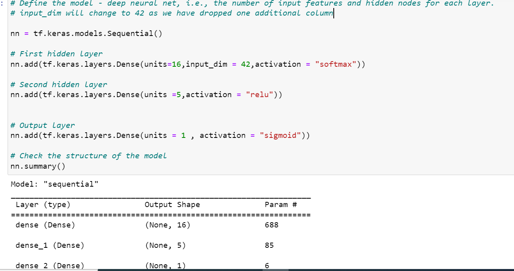
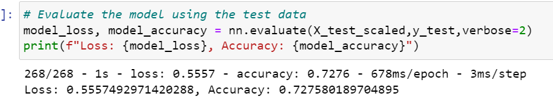

# Alphabet Soup Funding Model

## Overview of the Analysis

# Alphabet Soup Funding Model
* The nonprofit foundation Alphabet Soup wants a tool that can help it select the applicants for funding with the best chance of success in their ventures. With your knowledge of machine learning and neural networks, you’ll use the features in the provided dataset to create a binary classifier that can predict whether applicants will be successful if funded by Alphabet Soup.

# Data Preprocessing
#### What variable(s) are the target(s) for your model?
* The 'IS_SUCCESSFUL' column from application_df is the target variable, this is what we are trying to predict. This shows if the money was used effectively.
  
#### What variable(s) are the features for your model?
* The feature variables we used are:
  1. AFFILIATION—Affiliated sector of industry
  2. CLASSIFICATION—Government organization classification
  3. USE_CASE—Use case for funding
  4. ORGANIZATION—Organization type
  5. STATUS—Active status
  6. INCOME_AMT—Income classification
  7. SPECIAL_CONSIDERATIONS—Special considerations for application
  8. ASK_AMT—Funding amount requested

#### What variable(s) should be removed from the input data because they are neither targets nor features?
* Identification columns: The "EIN" and "NAME" columns are identification columns that typically provide unique identifiers for each organization. These columns usually have no direct impact on the target variable and can be dropped without affecting the model's accuracy.

### Compiling, Training, and Evaluating the Model

#### How many neurons, layers, and activation functions did you select for your neural network model, and why?
* In my first neural network model, I used a two-layer architecture with a specific choice for the number of neurons, layers, and activation functions.

* By selecting 16 neurons in the first hidden layer (units_1 = 16), 5 neurons in the second hidden layer (units_2 = 5), and using the ReLU activation function  and (activation="relu") for both hidden layers, you aimed to create a model with sufficient complexity to capture and learn meaningful patterns in the data. The choice of ReLU activation helps introduce non-linearity and allows the model to learn complex relationships between the input features and the target variable.

* Additionally, you used a single neuron in the output layer (units=1) with a sigmoid activation function (activation="sigmoid") to model the binary classification problem. The sigmoid activation function maps the output to a range between 0 and 1, representing the probability of the positive class.

* In summary, the model architecture with the chosen number of neurons, layers, and activation functions aimed to strike a balance between complexity and simplicity, allowing the model to learn and generalize well on the given classification task.

#### Were you able to achieve the target model performance?
* As you can see below I was only able to achieve 72%, which was not the target model performance which was 75%. 

#### What steps did you take in your attempts to increase model performance?
1. Increasing the number of epochs:
   

* Increasing the number of epochs gives the model more opportunities to learn from the data and adjust the weights. It allows the model to refine its predictions and find better parameter values, which can lead to improved accuracy. However, it's important to find a balance as increasing epochs excessively can lead to overfitting.

* As you can see, I was only able to achieve ~ 73%.

2. Adding more layers and nuerons to the model:

* Adding more layers can provide the model with additional capacity to capture and represent intricate relationships within the data. Each layer can learn different levels of abstraction, enabling the model to extract more meaningful features and potentially improving accuracy. Deep models with multiple layers have the ability to learn hierarchical representations of the data, which can be advantageous for complex problems.
* * By increasing the number of neurons in a layer, the model becomes more expressive and can capture complex patterns in the data. This allows for better representation of the underlying relationships between the features and the target variable, potentially leading to higher accuracy.
  

* Again, I was only able to achieve ~ 73%

3. Dropping one extra feature (STATUS):
   

* model will now have 42 input_dim

* results

* Again, I was only able to achieve ~ 73%

## Conclusion
The deep learning model that I have developed was unable to achieve accuracy higher than 73%. To further improve the model's performance, I can consider the following steps:

1. Adding more data:
   * Increasing the size of the training dataset can help the model learn from a larger and more diverse set of examples. This can improve the generalisation capability of the model and potentially lead to higher accuracy. Collecting additional data relevant to the classification problem could provide the model with more information to make better predictions.
  
2. Checking data cleaning:
   * Ensuring that the data is properly cleaned is crucial for model performance. Cleaning includes handling missing values, handling outliers, normalizing or standardizing features, and addressing any data quality issues. By thoroughly reviewing and cleaning the data, I can mitigate the impact of noise or irrelevant information that might be affecting the model's accuracy.
  
3. Exploring alternative machine learning algorithms:
   * Trying a different algorithm, such as Random Forest, can provide valuable insights into the importance of different features. Random Forest can measure feature importance based on how effectively each feature contributes to the overall prediction. This analysis can help identify the key predictor columns, allowing you to focus on the most informative features and potentially improve accuracy.

4. Identifying feature importance and selecting relevant attributes:
   * Analysing feature importance helps determine which attributes have the most significant impact on the output. By identifying and selecting the most important attributes, you can reduce the noise and complexity in the model. Focusing on the most relevant features can enhance the model's ability to capture meaningful patterns and improve accuracy.
  
5. Addressing high bias and outliers:
   * High bias in the model can be caused by outliers or skewed data points that deviate significantly from the majority of the dataset. Identifying and addressing these outliers can help improve the model's performance. Techniques such as outlier detection, data transformation, or stratified sampling can be applied to mitigate the impact of outliers and reduce bias in the model.

6. Binning the data:
   * Binning continuous variables can be useful in certain scenarios. It can help simplify the relationship between variables and the target variable by grouping similar values into bins. This can reduce the complexity of the model and make it more robust to noise or fluctuations in the data, potentially leading to improved accuracy.

In summary, to improve the deep learning model's performance, I would consider adding more data, ensuring proper data cleaning, exploring alternative algorithms, identifying feature importance, addressing bias and outliers, and applying data binning techniques. Each step aims to enhance the model's ability to capture relevant patterns and reduce noise, ultimately improving accuracy in the classification problem. It is important to iterate and experiment with these steps, evaluating the impact on model performance and fine-tuning as necessary.

